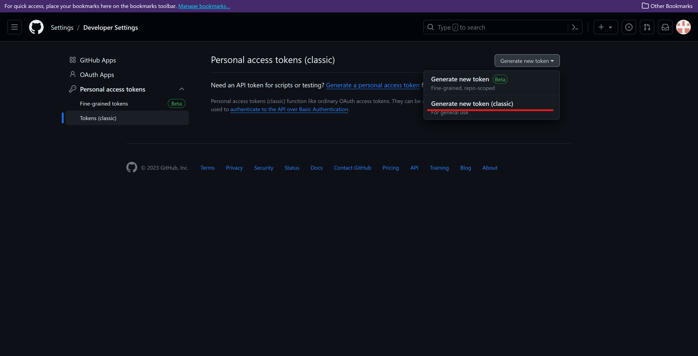

# Introduction

Git at its core is a file versioning tool. You choose an entire folder that git will keep track of (a folder that git is keeping track of is called a repository). Git does not automatically make new versions of your folder. If you don't touch git the folder basically keeps behaving like a normal one. Making a version with git is called a "commit". You can either click commit on your gui tool or do it via the command line (will be explained further down). Git then gives this commit a unique id. You can in the future then return to that version of the entire folder if you wish.   
   
Git also allows you to have multiple versions of the same folder at the same time (i.e. alternate universes). This is called a branch. You can freely jump between branches and create new ones (jumping to a new branch is called "checkout" in the git world). The big advantage is that you (or others) can work on the files, make any changes or even deletions, without worrying about something breaking or getting lost. If needed you can just switch branches and/or go back to a previous version of the folder where everything was still working. 

By default git is an offline tool, you have all of the different versions and alternate universes (the branches) on your own computer. To work with others on the same repository you can sync it with an online server. Those operations are called "pull" (to get the newest version from the server), "push" to push your newest version to the server. There is also fetch which is used to get info about what actually changed without pulling.

[This](https://www.youtube.com/watch?v=hwP7WQkmECE) is a good intro video on git itself and [this](https://www.youtube.com/watch?v=HkdAHXoRtos) one goes a bit more in depth.

# Install

First you'll have to install git itself from [this link](https://git-scm.com/downloads). It has instructions for every operating system.

## Windows

The easiest way to sync your syncs to github is to use the [Github Desktop App](https://desktop.github.com/). It will ask you to log into your account. After you'll be able to checkout the repository and push to it, etc. If you prefer using the command line you can read through the linux section, the commands are the same.

## Linux

If you are on linux its probably easiest to use the command line. The commands you'll need are the following (all things that you have to replace are in `[]`)

1. `git clone [repository-url]` this command downloads any online repository to your system. By default it creates a folder in the current directory with the same name as the repository. All files will go in there.
2. `git checkout [branch-name]` will get you into that branch.
3. `git branch [new-branch-name]` will create a new branch with the name you provided. It will be based on the current branch you are in.
4. `git pull` will download the newest version of the branch your are currently in from the online server (i.e. github in our case)
5. `git add . --all` adds all new files to the git repository. this is not a commit yet, its just there to make git aware of these files
6. `git commit --all -m "[your-message]"` commits the current version
7. `git push` pushes your changes to the server

### Authenticating under linux

Authentication is a bit anoying in linux. You'll have to do the following:

1. Generate a **P**ersonal**A**ccess**T**oken.
    1. Follow [this link](https://github.com/settings/tokens)
    2. Create a new classic token: 
    3. Set the expiration date to something reasonably long and click all the boxes.
    4. Click "Generate Token" and copy that token to your clipboard
2. Add the token
    1. Run `git config --global credential.helper store` so git remembers your logins
    2. The next time you run `git push` use your github username as the username and your PAT as the password
3. Ask Sidney if it still doesn't work

## Aberdeen VM

Unfortunately git is not installed on the VMs. The only way good way to sync your files is to remotely connect to your uni hard drive from your computer and then use git on your machine. [Here](https://www.abdn.ac.uk/toolkit/documents/uploads/winscp-home-drive-mar-2022.pdf) are the university's instructions on how to set that up.

# Github workflow and permissions

On github there is always one branch which acts as the default or common branch that contains the most recent working/approved version. By default no one is allowed to change this branch directly. Instead any changes you make have to be made to your own branch (or someone else's branch if you are working together). You can then create a "Pull request" to have your changes added to the main branch.

